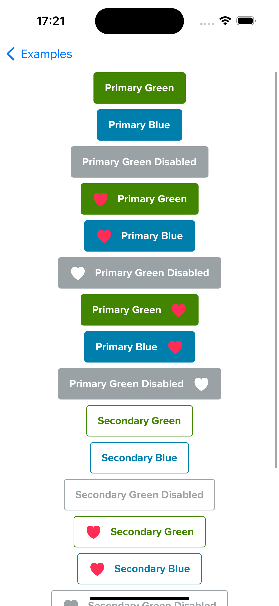
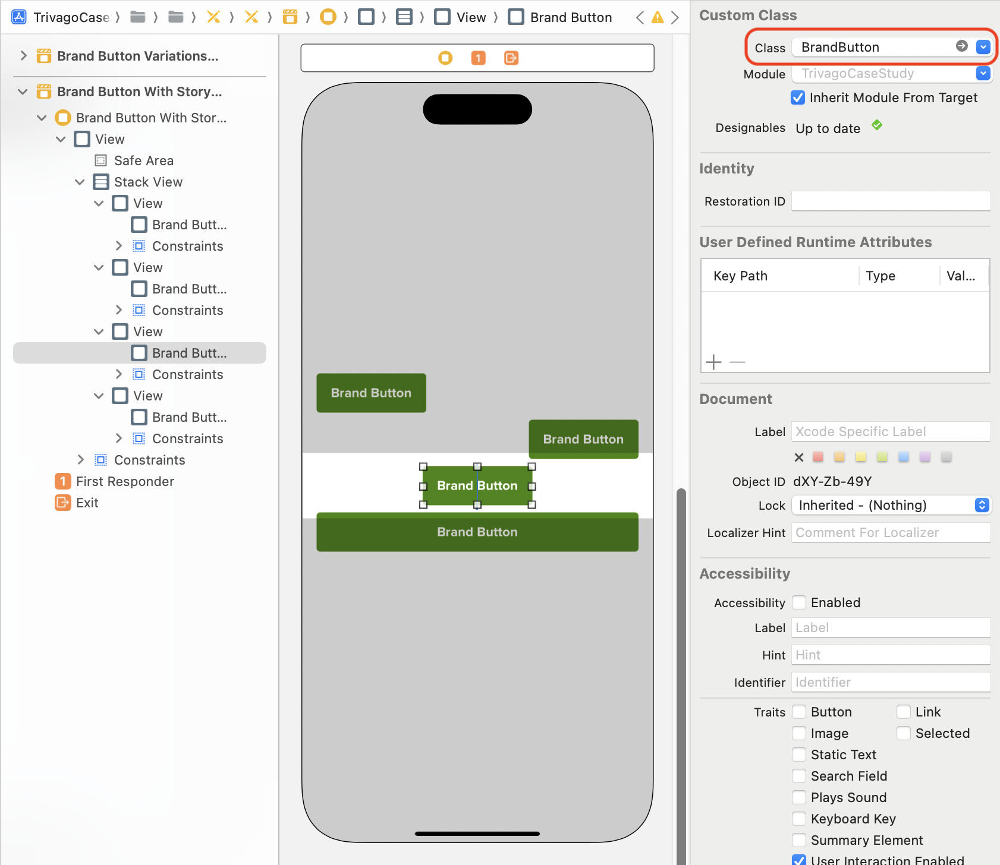

# BrandButton

<p align="center">
  
</p>

# Installation

TBD

# Usage

```swift
let button = BrandButton()
let configuration = BrandButton.Configuration(variant: .primary, color: .green, leadingIcon: nil, trailingIcon: UIImage(systemName: "heart.fill")!, isEnabled: true)
button.setConfiguration(configuration)
button.label = "My Shiny Button"
button.tintColor = UIColor.systemPink // To control the icon color
button.onTap = { print("Button works") }
```

## With Storyboard

1. In the Interface builder add a UIView to a ViewController

2. Change the class of the view to BrandButton

<p align="center">
  
</p>

3. Add position constraints. Don't add size constraints, they are calculated automatically

4. With 'Control + Drag' action add an @IBOutlet property to the ViewController's code

5. Configure the button in 'viewDidLoad' function in accordance with usage description

## With SwiftUI

```swift
import SwiftUI

struct BrandButtonDemoView: View {
    @State var buttonEnabled: Bool = true
    
    var body: some View {
        Spacer()
        VStack {
            HStack {
                BrandButtonRepresentable("My Shiny Button", leadingIcon: UIImage(systemName: "heart.fill")!, isEnabled: $buttonEnabled, onTap: { print("Button works") }).fixedSize().tint(.pink)
                Spacer()
            }
        }.padding()
        Spacer()
    }
}

#Preview {
    BrandButtonDemoView()
}
```

# Example Project

This repository comes with an example project in the `Example/` folder. Feel free to try it.
